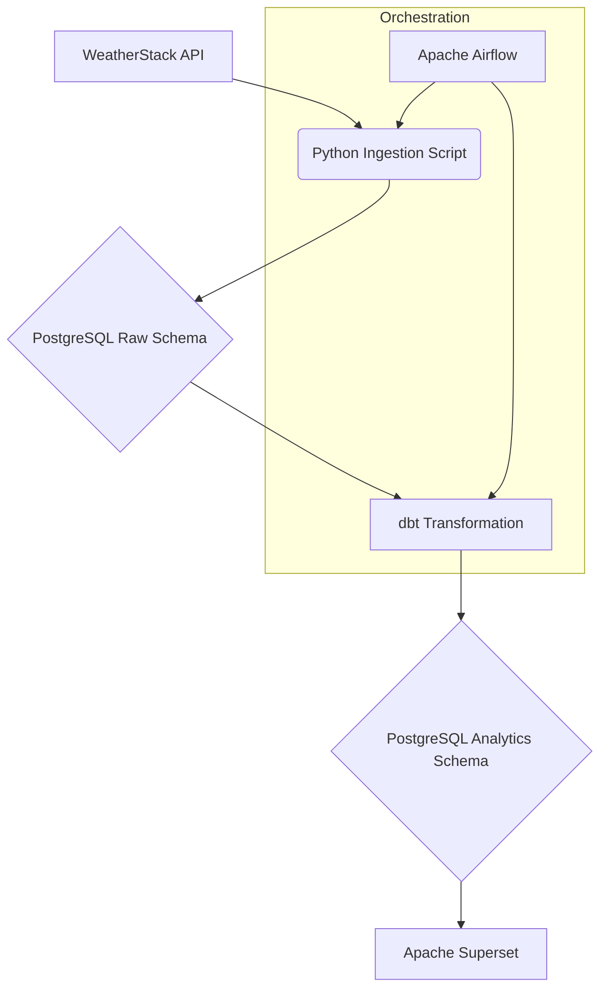

# 🌦️ End-to-End Weather ETL & Analytics Pipeline

## 📖 Overview
This project is a comprehensive Data Engineering solution designed to automate the collection, processing, and visualization of global weather data. It leverages a modern data stack to demonstrate a complete lifecycle: from raw API ingestion to interactive business intelligence dashboards.

The primary goal is to provide a reliable, automated system that tracks weather trends in real-time, ensuring data consistency through dbt transformations and accessibility via Apache Superset.

---

## 🏗️ Architecture & Component Logic




### 1. Ingestion Layer (Python + Airflow)
- **Logic**: A custom Python application utilizes the `requests` library to fetch JSON payloads from the **WeatherStack API**. 
- **Database Interaction**: Data is loaded into a **PostgreSQL** "Raw" schema (`dev`). The script handles connection pooling and ensures schema integrity by creating tables if they don't exist.
- **Orchestration**: **Apache Airflow** manages the workflow. It triggers the ingestion script on a defined schedule (Daily), handling retries and providing a clear UI for monitoring task status.

### 2. Storage Layer (PostgreSQL)
- **Schema Design**: 
    - `dev`: Contains the raw, immutable data exactly as received from the API.
    - `analytics`: Contains the cleaned, modeled tables generated by dbt for end-user consumption.
- **Persistence**: Docker volumes ensure that data persists even if containers are stopped or recreated.

### 3. Transformation Layer (dbt)
- **Logic**: dbt (Data Build Tool) acts as the T (Transform) in our ETL. It runs SQL-based models to:
    - **Deduplicate**: Remove any duplicate API entries.
    - **Format**: Clean timestamps and standardize units.
    - **Aggregate**: Calculate daily averages for temperature and wind speed.
- **Quality Control**: Integrated dbt tests ensure that critical columns (like IDs and Cities) are never null or broken.

### 4. Visualization Layer (Apache Superset)
- **Logic**: A powerful BI tool that connects directly to the `analytics` schema in Postgres.
- **Dashboarding**: Users can build complex time-series charts, maps, and heatmaps to explore weather patterns over time.

---

## 🛠️ Detailed Tech Stack & Dependencies

| Component | Technology | Description |
| :--- | :--- | :--- |
| **Orchestrator** | Apache Airflow 2.10 | Manages scheduling and task dependencies. |
| **Warehouse** | PostgreSQL 15 | Relational database for raw and modeled data. |
| **Transform** | dbt-core 1.9 | Handles SQL modeling and data quality tests. |
| **BI Tool** | Apache Superset 3.0 | Web-based data exploration and dashboarding. |
| **Message Broker**| Redis 7 | Used by Superset for caching and task management. |
| **Language** | Python 3.10 | Used for the custom ingestion logic and Airflow DAGs. |

**Python Dependencies:**
- `requests`: For API communication.
- `psycopg2-binary`: For PostgreSQL interaction.
- `python-dotenv`: For secure environment variable management.

---

##  Full Usage Guide

### 1. Initial Setup
1. **Clone the Project**:
   ```bash
   git clone <your-repo-url>
   cd WEATHER-ETL
   ```
2. **Configure Environment**:
   Create a `.env` file in the root directory. This is critical for authentication.
   ```env
   # API Keys
   WEATHER_STACK_API=your_api_key_here
   API_URL=http://api.weatherstack.com/current

   # PostgreSQL Configuration
   POSTGRES_USER=db_user
   POSTGRES_PASSWORD=db_password
   POSTGRES_DB=weather_db

   # Airflow Credentials
   AIRFLOW_ADMIN_USERNAME=admin
   AIRFLOW_ADMIN_PASSWORD=admin
   ```

### 2. Execution Flow
1. **Start Infrastructure**:
   ```powershell
   docker-compose up -d --build
   ```
   *Wait for all containers to show as "Healthy".*

2. **Run Manual Test Ingestion**:
   To verify immediately that the API is talking to your database:
   ```powershell
   docker exec -it airflow_container python /opt/airflow/api-request/insert_record.py
   ```

3. **Run Transformations**:
   Execute dbt to build the analytics tables:
   ```powershell
   docker exec -it dbt_container dbt run --project-dir /usr/app/dbt/weather_project --profiles-dir /usr/app/dbt
   ```

4. **Activate Automation**:
   - Access Airflow at [http://localhost:8080](http://localhost:8080).
   - Toggle the `weather_api__dbt_orchestrator` switch to **ON**.

### 3. Creating Your Dashboard
1. Open Superset: [http://localhost:8088](http://localhost:8088) (`admin` / `admin`).
2. **Connnect Database**:
   - Host: `postgres` | Port: `5432` | DB: `weather_db`.
3. **Add Dataset**:
   - Schema: `analytics` | Table: `weather_report`.
4. **Build Charts**:
   - Select "Time-series Line Chart" using the `temperature` metric and `time` dimension.

---

## 📁 Project Structure Details

- `airflow/dags/`: Contains `orchestrator.py`, the brain of the pipeline.
- `api-request/`: The ingestion logic (`api.py` handles the requests, `insert_record.py` handles the DB).
- `dbt/weather_project/`: The full dbt project including sources and SQL models.
- `docker/`: Contains the critical `superset_config.py` and bootstrap scripts that ensure Superset runs securely on Docker.
- `postgres/`: Initialization SQL scripts that set up the users and databases on first boot.

---

## � Security & Best Practices
- **Variables**: No hardcoded passwords or API keys. All secrets are managed via `.env` files.
- **Networking**: All containers reside in a private Docker network (`my_network`), keeping the database hidden from the public internet.
- **Git**: A `.gitignore` is provided to ensure your local virtual environments and secret keys are never committed to version control.

---
*Developed for robust weather data analysis.*